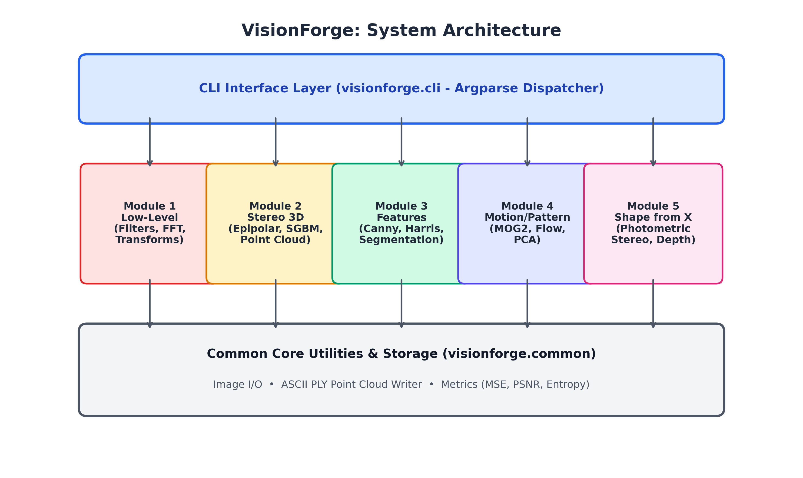
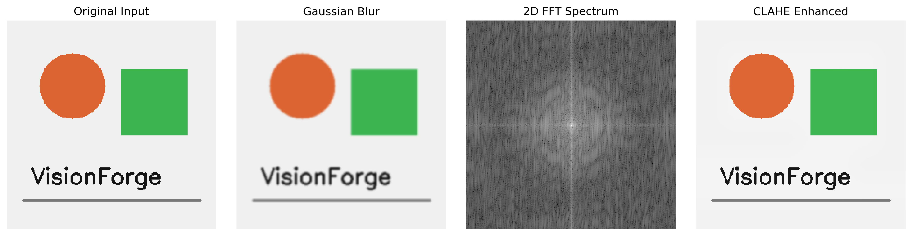
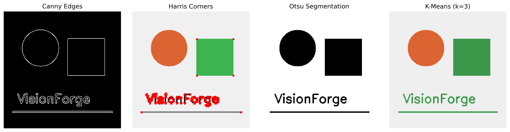
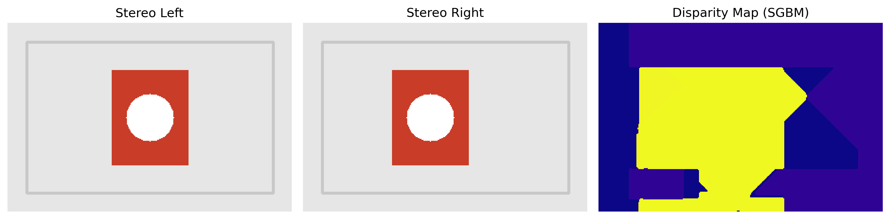
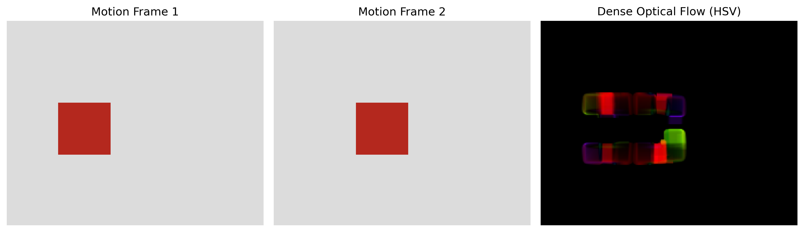
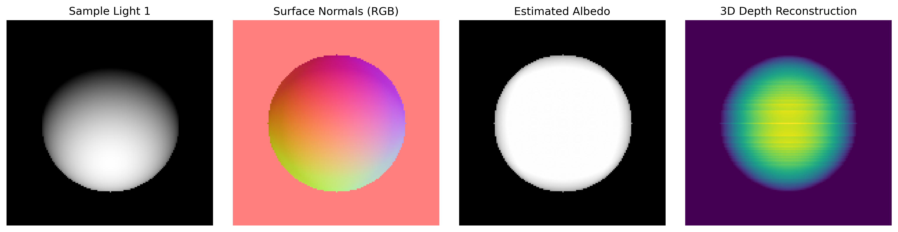

# VisionForge: Computer Vision CLI Toolkit & 3D Reconstruction Suite

[](https://www.python.org/)
[](https://opencv.org/)
[](tests/)

VisionForge is a modular, beginner-friendly Computer Vision CLI application and experimental suite built for university coursework. It unifies foundational computer vision concepts across image filtering, multi-camera 3D reconstruction, feature extraction, motion analysis, and shape recovery into a single command-line interface.

---

## Table of Contents
- [Overview](#overview)
- [Key Features](#key-features)
- [System Architecture](#system-architecture)
- [Technologies Used](#technologies-used)
- [Installation](#installation)
- [Usage Guide](#usage-guide)
  - [1. Low-Level Processing & Filtering](#1-low-level-processing--filtering)
  - [2. Feature Extraction & Segmentation](#2-feature-extraction--segmentation)
  - [3. Stereo Vision & 3D Point Cloud](#3-stereo-vision--3d-point-cloud)
  - [4. Motion & Pattern Analysis](#4-motion--pattern-analysis)
  - [5. Shape from X (Photometric Stereo)](#5-shape-from-x-photometric-stereo)
- [Running Unit Tests](#running-unit-tests)
- [Visual Results](#visual-results)
- [Author](#author)

---

## Overview

Computer vision covers a wide range of topics from 2D pixel transformations to full 3D spatial reasoning. VisionForge provides clean, accessible, and well-structured implementations of core algorithms aligned directly with the course syllabus:
1. **Low-Level Image Processing**: Spatial convolution (Gaussian, Bilateral, Laplacian), 2D Fourier Transform (FFT), geometric transformations, and contrast enhancement (Histogram Equalization & CLAHE).
2. **Stereo Vision & Epipolar Geometry**: Perspective stereopsis, disparity map calculation (SGBM), fundamental matrix estimation, and ASCII PLY 3D point cloud generation.
3. **Feature Detection & Segmentation**: Canny edge detector, Harris corner detector, Hough line transform, SIFT/ORB keypoint matching, image pyramids, Otsu thresholding, and K-Means color segmentation.
4. **Motion & Pattern Analysis**: Frame differencing, MOG2 background subtraction, Farneback dense optical flow, Lucas-Kanade sparse motion tracking, and PCA dimensionality reduction.
5. **Shape from X**: Photometric stereo recovering surface normal vectors, albedo maps, and integrated surface depth maps from multi-illumination images.

---

## Key Features

- **Beginner-Friendly Codebase**: Clean functions, clear naming conventions, and minimal boilerplate.
- **Unified Command-Line Interface**: Run any module easily via standard `python -m visionforge.cli <subcommand>`.
- **Built-in Synthetic Dataset Generator**: Instant, reproducible sample assets created with a single command.
- **3D Export Capability**: Export stereo reconstructions directly to standard `.ply` files viewable in MeshLab or Blender.
- **Quantitative Quality Metrics**: Instant calculation of PSNR, MSE, and Shannon Entropy for filtered images.

---

## System Architecture

VisionForge is organized into a modular three-tier architecture:



### Design & UML Diagrams
- **Workflow Diagram**: `docs/diagrams/workflow_diagram.png`
- **Use Case Diagram**: `docs/diagrams/usecase_diagram.png`
- **Class / Component Diagram**: `docs/diagrams/class_diagram.png`
- **Sequence Diagram**: `docs/diagrams/sequence_diagram.png`

---

## Technologies Used

- **Language**: Python 3.9+ (tested on Python 3.13 on Windows 11)
- **Computer Vision**: OpenCV (`opencv-python`)
- **Scientific Computing**: NumPy, SciPy
- **Machine Learning**: scikit-learn (PCA, clustering)
- **Visualization**: Matplotlib
- **Testing**: pytest
- **Documentation & Report**: fpdf2

---

## Installation

1. **Clone the repository**:
   ```bash
   git clone <repo-url>
   cd cv
   ```

2. **Install dependencies**:
   ```bash
   pip install -r requirements.txt
   ```

3. **Generate sample datasets**:
   ```bash
   python data/generate_samples.py
   ```

---

## Usage Guide

All operations are executed through `visionforge.cli`. Below are examples for each module:

### 1. Low-Level Processing & Filtering
```bash
# Apply Gaussian Blur
python -m visionforge.cli lowlevel -i data/input_sample.png -o output/blur.png -a gaussian

# Compute 2D FFT Magnitude Spectrum
python -m visionforge.cli lowlevel -i data/input_sample.png -o output/fft.png -a fft

# Apply Frequency Domain Low-Pass Filter
python -m visionforge.cli lowlevel -i data/input_sample.png -o output/fft_low.png -a fft_lowpass

# Apply CLAHE Contrast Enhancement
python -m visionforge.cli lowlevel -i data/input_sample.png -o output/clahe.png -a clahe
```

### 2. Feature Extraction & Segmentation
```bash
# Detect Canny Edges
python -m visionforge.cli features -i data/input_sample.png -o output/canny.png -a canny

# Detect Harris Corners
python -m visionforge.cli features -i data/input_sample.png -o output/harris.png -a harris

# Otsu Threshold Segmentation
python -m visionforge.cli features -i data/input_sample.png -o output/otsu.png -a otsu

# K-Means Color Segmentation (k=3)
python -m visionforge.cli features -i data/input_sample.png -o output/kmeans.png -a kmeans
```

### 3. Stereo Vision & 3D Point Cloud
```bash
# Compute Disparity Map and Export 3D Point Cloud (.ply)
python -m visionforge.cli stereo -l data/stereo_left.png -r data/stereo_right.png -o output/disparity.png --ply output/points.ply
```

### 4. Motion & Pattern Analysis
```bash
# Compute Frame Differencing
python -m visionforge.cli motion -f1 data/motion_frame1.png -f2 data/motion_frame2.png -o output/diff.png -a diff

# Compute Dense Optical Flow (Farneback HSV)
python -m visionforge.cli motion -f1 data/motion_frame1.png -f2 data/motion_frame2.png -o output/flow.png -a dense_flow

# Image Compression using PCA
python -m visionforge.cli motion -f1 data/input_sample.png -f2 data/input_sample.png -o output/pca.png -a pca
```

### 5. Shape from X (Photometric Stereo)
```bash
# Reconstruct Surface Normals, Albedo, and Depth from 4 Illumination Images
python -m visionforge.cli shape -i data/light1.png data/light2.png data/light3.png data/light4.png -o output/normals.png
```

---

## Running Unit Tests

Run the complete test suite using `pytest`:
```bash
python -m pytest -v
```

All 12 automated unit tests across all 5 syllabus modules will execute and report passing status.

---

## Visual Results

### Low-Level Image Processing


### Feature Detection & Segmentation


### Stereo Disparity Estimation


### Dense Optical Flow Motion Vectors


### Photometric Stereo Normal & Depth Recovery


---

## Author

- **Name**: Paarth Juneja
- **Email**: paarthjuneja2006@gmail.com
- **Course**: Computer Vision Coursework Project
